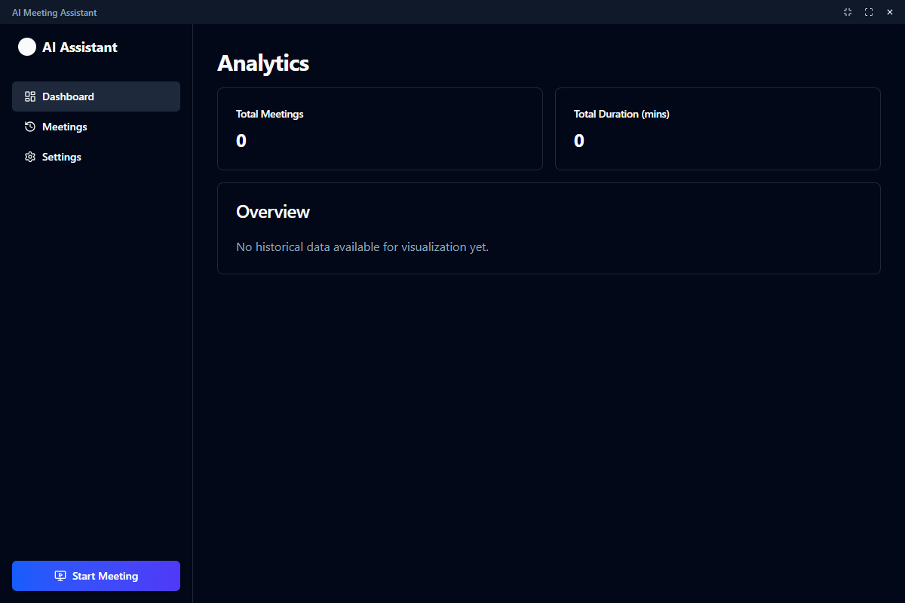

# AI Meeting Assistant 🎙️🤖

An intelligent desktop application that transcribes your meetings in real-time and uses AI to extract action items, decisions, and summaries. Built with Electron, React, and cutting-edge AI services.



## 🚀 Key Features

-   **Real-Time Transcription**: Live speech-to-text powered by Deepgram Nova-2 with speaker diarization.
-   **AI Intelligence**: Automatically detects **Action Items**, **Decisions**, and **Risks** using OpenAI GPT-4o.
-   **Smart Overlay**: A non-intrusive, always-on-top window that displays live transcripts and insights during your calls.
-   **Meeting Dashboard**: Review past meeting history, full transcripts, and analytics.
-   **Post-Meeting Summary**: Generates comprehensive executive summaries and key takeaways after every session.
-   **Quiet Mode**: Toggle the transcript display to focus only on critical AI insights.
-   **Export Options**: Download meeting notes and transcripts as Markdown.
-   **Secure & Local**: Recordings are processed in memory; data is stored locally on your device.

## 🛠️ Tech Stack

-   **Desktop Framework**: [Electron](https://www.electronjs.org/)
-   **Frontend**: [React](https://react.dev/) + [TypeScript](https://www.typescriptlang.org/)
-   **Build Tool**: [Vite](https://vitejs.dev/)
-   **Styling**: [TailwindCSS](https://tailwindcss.com/) + [shadcn/ui](https://ui.shadcn.com/)
-   **Transcription (STT)**: [Deepgram Streaming API](https://deepgram.com/)
-   **Intelligence (LLM)**: [OpenAI API](https://openai.com/) (GPT-4o)
-   **Data Storage**: [electron-store](https://github.com/sindresorhus/electron-store) (Local JSON)

## 🏁 Getting Started

### Prerequisites

-   Node.js (v18 or higher)
-   npm or yarn
-   **Deepgram API Key** (Get one at [console.deepgram.com](https://console.deepgram.com/))
-   **OpenAI API Key** (Get one at [platform.openai.com](https://platform.openai.com/))

### Installation

1.  **Clone the repository**
    ```bash
    git clone https://github.com/muhammadiwa/AI-Meeting-Assistant
    cd AI-Meeting-Assistant
    ```

2.  **Install dependencies**
    ```bash
    npm install
    ```

### Configuration

1.  Launch the application:
    ```bash
    npm run dev
    ```
2.  Open the **Settings** (Gear icon in the overlay).
3.  Enter your **Deepgram API Key** and **OpenAI API Key**.
4.  Select your preferred **Microphone** and **System Audio** source (if available).

### Running the App

-   **Development Mode**:
    ```bash
    npm run dev
    ```
-   **Production Build**:
    ```bash
    npm run build
    ```

## 📖 Usage Guide

1.  **Start a Meeting**:
    -   Click the **Record** button (Red Circle) in the Overlay.
    -   Select the screen/window you want to capture audio from (typically your meeting window like Zoom/Meet).
2.  **During the Meeting**:
    -   View the live transcript scrolling in real-time.
    -   Watch for AI Insights (Action Items, Decisions) appearing as toasts.
    -   Use **Quiet Mode** (Eye icon) to hide the text if it's distracting.
3.  **End the Meeting**:
    -   Click the **Stop** button.
    -   Wait a moment for the **Summary Generation** to complete.
    -   You will be automatically redirected to the **Meeting Detail** view.
4.  **Review & Export**:
    -   In the Dashboard, view the Executive Summary and full Transcript.
    -   Click **Export to Markdown** to save the notes for sharing.

## 🗺️ Roadmap

-   [x] Real-time Transcription & Diarization
-   [x] AI Insight Extraction (Actions, Decisions)
-   [x] Meeting History & Search
-   [x] Post-meeting Summary Generation
-   [ ] Multi-language Support
-   [ ] Calendar Integration
-   [ ] CRM Integration (HubSpot, Salesforce)

## 🤝 Contributing

Contributions are welcome! Please feel free to submit a Pull Request.

## 📄 License

This project is licensed under the MIT License - see the [LICENSE](LICENSE) file for details.
